# Agent 完整流程链条图

## 流程总览（完整串联）

```mermaid
flowchart LR
    %% === 项目启动 ===
    USER["用户想法"] --> PM_INIT["project-initiation-phase.md<br/>(Project Manager)"]
    PM_INIT --> BA_RCP["requirements-collection-phase.md<br/>(BA)"]
    BA_RCP --> BRD["BRD.md"]

    %% === BA Review 阶段 ===
    BRD --> BAR_RP["review-phase.md<br/>(BAR)"]
    BAR_RP --> BRD_REV["BRD_REVIEW.md"]
    BRD_REV --> BA_RSP["review-response-phase.md<br/>(BA)"]
    BA_RSP --> BRD_FB["BRD_REVIEW_FEEDBACK.md"]
    BRD_FB --> BAR_FP["feedback-processing-phase.md<br/>(BAR)"]
    BAR_FP --> BRD_APP["BRD_APPROVE.md"]

    %% === Product Designer 阶段（两种模式）===
    BRD --> PD["Product Designer"]
    BRD_APP --> PD

    PD -->|"小项目"| PD_DP["design-phase.md<br/>(PD)"]
    PD_DP --> PRD["PRODUCT-DESIGN.md"]

    PD -->|"大项目"| PD_MDP["module-decomposition-phase.md<br/>(PD)"]
    PD_MDP --> HL_DESIGN["PRODUCT-DESIGN-HIGH-LEVEL.md"]

    %% === 高层设计评审（大项目）===
    HL_DESIGN --> PR_HL["review-phase.md<br/>(PR)"]
    PR_HL --> HL_REV["PRODUCT-DESIGN-HIGH-LEVEL_REVIEW.md"]
    HL_REV --> PD_RSP_HL["review-response-phase.md<br/>(PD)"]
    PD_RSP_HL --> HL_FB["PRODUCT-DESIGN-HIGH-LEVEL_REVIEW_FEEDBACK.md"]
    HL_FB --> PR_FP_HL["feedback-processing-phase.md<br/>(PR)"]
    PR_FP_HL --> HL_APP["PRODUCT-DESIGN-HIGH-LEVEL_APPROVE.md"]

    %% === PM 编排模块设计（大项目）===
    HL_APP --> PM_ORCH["stage-transition-phase.md<br/>(Project Manager)"]
    PM_ORCH -->|"按依赖关系编排"| PD_MOD["design-phase.md<br/>(PD - 各模块)"]
    PD_MOD --> MOD_DESIGN["PRODUCT-DESIGN-{M}.md"]

    MOD_DESIGN --> PR_MOD["review-phase.md<br/>(PR)"]
    PR_MOD --> MOD_APP["PRODUCT-DESIGN-{M}_APPROVE.md"]
    MOD_APP --> PM_ORCH

    %% === 产品评审（小项目）===
    PRD --> PR_RP["review-phase.md<br/>(PR)"]
    PR_RP --> PRD_REV["PRODUCT-DESIGN_REVIEW.md"]
    PRD_REV --> PD_RSP["review-response-phase.md<br/>(PD)"]
    PD_RSP --> PRD_FB["PRODUCT-DESIGN_REVIEW_FEEDBACK.md"]
    PRD_FB --> PR_FP["feedback-processing-phase.md<br/>(PR)"]
    PR_FP --> PRD_APP["PRODUCT-DESIGN_APPROVE.md"]

    %% === UI Designer 阶段（两种模式）===
    PRD_APP --> UID_DP["design-phase.md<br/>(UID - 小项目)"]
    UID_DP --> UI_D["UI-DESIGN.md/.pen<br/>DEMO.md/.pen"]

    %% === UI Designer 大项目模式 ===
    MOD_APP -->|"所有模块通过"| UID_SG["style-guide-phase.md<br/>(UID - 大项目)"]
    UID_SG --> UI_SG["UI-STYLE-GUIDE.md/.pen"]
    UI_SG --> UIR_SG_RP["review-phase.md<br/>(UIR - 风格指南)"]
    UIR_SG_RP --> UI_SG_REV["UI-STYLE-GUIDE_REVIEW.md"]
    UI_SG_REV --> UID_RSP_SG["review-response-phase.md<br/>(UID)"]
    UID_RSP_SG --> UIR_SG_FP["feedback-processing-phase.md<br/>(UIR)"]
    UIR_SG_FP --> UI_SG_APP["UI-STYLE-GUIDE_APPROVE.md"]
    UI_SG_APP --> PM_ORCH_UID["stage-transition-phase.md<br/>(PM 编排模块 UI)"]
    PM_ORCH_UID -->|"按模块编排"| UID_MOD["design-phase.md<br/>(UID - 各模块)"]
    UID_MOD --> UI_MOD["UI-DESIGN-{M}.md/.pen<br/>DEMO-{M}.md/.pen"]
    UI_MOD --> UIR_MOD_RP["review-phase.md<br/>(UIR - 模块)"]
    UIR_MOD_RP --> UI_MOD_APP["UI-DESIGN-{M}_APPROVE.md"]

    %% === UI Review 阶段（小项目）===
    UI_D --> UIR_RP["review-phase.md<br/>(UIR)"]
    PRD --> UIR_RP
    UIR_RP --> UI_REV["UI-DESIGN_REVIEW.md"]
    UI_REV --> UID_RSP["review-response-phase.md<br/>(UID)"]
    UID_RSP --> UI_FB["UI-DESIGN_REVIEW_FEEDBACK.md"]
    UI_FB --> UIR_FP["feedback-processing-phase.md<br/>(UIR)"]
    UIR_FP --> UI_APP["UI-DESIGN_APPROVE.md"]

    %% === Technical Feasibility 阶段 ===
    PRD --> TFA_AP["analysis-phase.md<br/>(TFA)"]
    UI_D --> TFA_AP
    UI_APP --> TFA_AP
    TFA_AP --> TFR["TECH-FEASIBILITY-REPORT.md"]
    TFA_AP -->|"如有调整"| PRD_ADJ["PRODUCT-DESIGN_ADJUSTMENT.md"]

    %% === PD 回应技术调整 ===
    PRD_ADJ --> PD_TAR["tech-adjustment-response-phase.md<br/>(PD)"]
    PD_TAR --> PRD_ADJ_FB["PRODUCT-DESIGN_ADJUSTMENT_FEEDBACK.md"]
    PRD_ADJ_FB --> TFA_FP["feedback-processing-phase.md<br/>(TFA)"]
    TFA_FP --> TFA_CONFIRM["TECH-FEASIBILITY-ADJUSTMENT-CONFIRMATION.md<br/>(通过 + 失效声明)"]

    %% === Architect 阶段 ===
    TFA_CONFIRM --> ARC_DP["design-phase.md<br/>(ARC)"]
    TFR -->|"无调整，直接通过"| ARC_DP
    PRD --> ARC_DP
    UI_D --> ARC_DP
    ARC_DP --> ARCH["ARCHITECTURE.md"]
    ARC_DP --> MOD_DEP["MODULE-DEPENDENCIES.md<br/>（大项目）"]

    %% === Architecture Review 阶段 ===
    ARCH --> ARCR_RP["review-phase.md<br/>(ARCR)"]
    MOD_DEP --> ARCR_RP
    ARCR_RP --> ARCH_REV["ARCHITECTURE_REVIEW.md"]
    ARCH_REV --> ARC_RSP["review-response-phase.md<br/>(ARC)"]
    ARC_RSP --> ARCH_FB["ARCHITECTURE_REVIEW_FEEDBACK.md"]
    ARCH_FB --> ARCR_FP["feedback-processing-phase.md<br/>(ARCR)"]
    ARCR_FP --> ARCH_APP["ARCHITECTURE_APPROVE.md"]

    %% === Implementation Designer 阶段（两种模式）===
    ARCH --> IMPD_DP["design-phase.md<br/>(IMPD - 小项目)"]
    ARCH_APP --> IMPD_DP
    PRD --> IMPD_DP
    UI_D --> IMPD_DP
    IMPD_DP -->|"可选澄清"| ARC_CL["clarification-response-phase.md<br/>(ARC)"]
    IMPD_DP --> API_S["API-SPEC.md"]
    API_S --> BE_D["BACKEND-DESIGN.md"]
    API_S --> FE_D["FRONTEND-DESIGN.md"]
    API_S --> TC_API["TEST-CASES-API.md"]
    BE_D --> TC_BE["TEST-CASES-BACKEND.md"]
    FE_D --> TC_FE["TEST-CASES-FRONTEND.md"]

    %% === IMPD 大项目模式 ===
    ARCH_APP -->|"大项目按模块编排"| PM_ORCH_IMPD["stage-transition-phase.md<br/>(PM 编排模块实现设计)"]
    PM_ORCH_IMPD -->|"按依赖顺序编排"| IMPD_MOD["design-phase.md<br/>(IMPD - 各模块)"]
    IMPD_MOD -->|"读取上游 API-SPEC-{upstream-M}.md"| API_S_M["API-SPEC-{M}.md"]
    API_S_M --> BE_D_M["BACKEND-DESIGN-{M}.md"]
    API_S_M --> FE_D_M["FRONTEND-DESIGN-{M}.md"]
    API_S_M --> TC_API_M["TEST-CASES-{M}-API.md"]
    BE_D_M --> TC_BE_M["TEST-CASES-{M}-BACKEND.md"]
    FE_D_M --> TC_FE_M["TEST-CASES-{M}-FRONTEND.md"]

    %% === Implementation Review 阶段（小项目）===
    API_S --> IMPR_RP["review-phase.md<br/>(IMPR)"]
    FE_D --> IMPR_RP
    BE_D --> IMPR_RP
    TC_API --> IMPR_RP
    TC_BE --> IMPR_RP
    TC_FE --> IMPR_RP
    IMPR_RP --> IMP_REV["IMPLEMENTATION_REVIEW.md"]
    IMP_REV --> IMPD_RSP["review-response-phase.md<br/>(IMPD)"]
    IMPD_RSP --> IMP_FB["IMPLEMENTATION-REVIEW_FEEDBACK.md"]
    IMP_FB --> IMPR_FP["feedback-processing-phase.md<br/>(IMPR)"]
    IMPR_FP --> IMP_APP["IMPLEMENTATION_APPROVE.md"]

    %% === IMPR 大项目模块评审 ===
    API_S_M --> IMPR_MOD["review-phase.md<br/>(IMPR - 模块)"]
    FE_D_M --> IMPR_MOD
    BE_D_M --> IMPR_MOD
    IMPR_MOD --> IMP_MOD_APP["IMPLEMENTATION-{M}_REVIEW.md<br/>→ IMPLEMENTATION-{M}_APPROVE.md"]

    %% === Coding 阶段（按任务单元执行）===
    PM_ST["stage-transition-phase.md<br/>(Project Manager)"] -->|"任务编排"| TASK_ORCH["任务编排<br/>(串行/并行)"]

    TASK_ORCH -->|"分配"| TASK_1["任务单元1"]
    TASK_1 --> CA_1["coding-phase.md<br/>(CA)"]
    IMP_APP --> CA_1
    CA_1 --> T1_CC["TASK_UNIT_1_CODING_COMPLETE.md"]
    T1_CC --> CR_1_RP["review-phase.md<br/>(CR)"]
    CR_1_RP --> T1_REV["TASK_UNIT_1_CODE_REVIEW.md"]
    T1_REV --> CA_1_RSP["review-response-phase.md<br/>(CA)"]
    CA_1_RSP --> T1_FB["TASK_UNIT_1_CODE_REVIEW_FEEDBACK.md"]
    T1_FB --> CR_1_FP["feedback-processing-phase.md<br/>(CR)"]
    CR_1_FP --> T1_APP["TASK_UNIT_1_CODING_APPROVE.md"]

    TASK_ORCH -->|"分配"| TASK_2["任务单元2"]
    TASK_2 --> CA_2["coding-phase.md<br/>(CA)"]
    CA_2 --> T2_CC["TASK_UNIT_2_CODING_COMPLETE.md"]
    T2_CC --> CR_2_RP["review-phase.md<br/>(CR)"]
    CR_2_RP --> T2_APP["TASK_UNIT_2_CODING_APPROVE.md"]

    TASK_ORCH -->|"分配"| TASK_N["任务单元N"]
    TASK_N --> CA_N["coding-phase.md<br/>(CA)"]
    CA_N --> TN_CC["TASK_UNIT_N_CODING_COMPLETE.md"]
    TN_CC --> CR_N_RP["review-phase.md<br/>(CR)"]
    CR_N_RP --> TN_APP["TASK_UNIT_N_CODING_APPROVE.md"]

    T1_APP --> ALL_DONE["所有任务单元<br/>CODING_APPROVE"]
    T2_APP --> ALL_DONE
    TN_APP --> ALL_DONE

    %% === 人工集成 ===
    ALL_DONE --> MERGE["人工集成<br/>(merge 到主分支)"]
    MERGE --> CODE_INT["CODE-INTEGRATION-COMPLETE.md"]

    %% === E2E 测试设计阶段 ===
    CODE_INT --> E2ET_TDP["test-design-phase.md<br/>(E2ET)"]
    E2ET_TDP --> E2E_TC["E2E-TEST-CASES.md<br/>E2E test code"]

    %% === E2E 测试设计评审 ===
    E2E_TC --> E2ER_RP["review-phase.md<br/>(E2ER)"]
    E2ER_RP --> E2E_REV["E2E-REVIEW.md"]
    E2E_REV --> E2ET_RSP["review-response-phase.md<br/>(E2ET)"]
    E2ET_RSP --> E2E_FB["E2E-REVIEW-FEEDBACK.md"]
    E2E_FB --> E2ER_FP["feedback-processing-phase.md<br/>(E2ER)"]
    E2ER_FP --> E2E_DA["E2E-DESIGN-APPROVE.md"]

    %% === E2E 测试执行阶段 ===
    E2E_DA --> E2ET_TEP["test-execution-phase.md<br/>(E2ET)"]
    E2ET_TEP --> E2E_TR["E2E-TEST-REPORT-R{N}.md"]

    E2ET_TEP -->|"有失败"| E2E_BR["E2E-BUG-REPORT-R{N}.md"]
    E2E_BR --> BFA_BFP["bug-fix-phase.md<br/>(BFA)"]
    BFA_BFP --> BUG_FIX["BUG-FIX-REPORT.md"]
    BUG_FIX --> CR_BF["review-phase.md<br/>(CR - 缺陷修复评审)"]
    CR_BF --> BF_REV["BUG-FIX_REVIEW.md"]
    BF_REV --> BFA_RSP["review-response-phase.md<br/>(BFA)"]
    BFA_RSP --> BF_FB["BUG-FIX_REVIEW_FEEDBACK.md"]
    BF_FB --> CR_BF_FP["feedback-processing-phase.md<br/>(CR)"]
    CR_BF_FP --> BF_APP["BUG-FIX_APPROVE.md"]
    BF_APP -->|"修复通过，重新测试"| E2ET_TEP

    E2ET_TEP -->|"不收敛"| E2E_PAUSE["E2E-TEST-PAUSED.md"]
    E2E_PAUSE --> PM_CF["conflict-resolution-phase.md<br/>(Project Manager)"]
    PM_CF --> HUMAN1["人工介入"]

    E2ET_TEP -->|"满足完成条件"| E2E_FINAL["E2E_APPROVE.md"]

    %% === 项目完成 ===
    E2E_FINAL --> PM_PC["project-completion-phase.md<br/>(Project Manager)"]
    PM_PC --> PROJECT_DONE["PROJECT-COMPLETE.md<br/>✅ 项目完成"]

    %% === 项目复盘 ===
    PROJECT_DONE --> PRV_RP["project-review-phase.md<br/>(Project Reviewer)"]
    PRV_RP --> PRV_OPT["AGENT-OPTIMIZATION.md"]
    PRV_RP --> PRV_REV["PROJECT-REVIEW.md"]

    %% === 矛盾处理（随时可能触发）===
    ANY_AGENT["任意 Agent"] -->|"DOCUMENT_CONFLICT.md"| PM_CF
    ANY_AGENT -->|"REVIEW_PAUSED.md"| PM_CF
    BFA_BFP -->|"设计文档问题"| PM_CF
```



---

## Agent 缩写对照表

| 缩写 | Agent 全称 | 说明 |
|-----|-----------|------|
| **PM** | Project Manager | 流程推进者（项目管理） |
| **BA** | Business Analyst | 业务分析师 |
| **BAR** | Business Analyst Reviewer | 业务分析师评审 |
| **PD** | Product Designer | 产品设计师（支持递归拆分） |
| **PR** | Product Reviewer | 产品评审（支持完整/高层/模块评审） |
| **UID** | UI Designer | 界面设计师（支持完整设计/风格指南+模块UI） |
| **UIR** | UI Reviewer | 界面评审（支持完整/风格指南/模块UI评审） |
| **TFA** | Technical Feasibility Analyst | 技术可行性分析师 |
| **ARC** | Architect | 架构师 |
| **ARCR** | Architecture Reviewer | 架构评审 |
| **IMPD** | Implementation Designer | 实现设计师（支持整体/按模块设计） |
| **IMPR** | Implementation Reviewer | 实现设计评审（支持整体/按模块评审） |
| **CA** | Coding Agent | 代码实现（全栈） |
| **CR** | Code Reviewer | 代码评审 |
| **E2ET** | E2E Tester | 端到端测试（用户视角） |
| **E2ER** | E2E Reviewer | 端到端测试评审（评审测试设计） |
| **BFA** | Bug Fix Agent | 缺陷修复 |
| **PRV** | Project Reviewer | 项目复盘 |

---

## 文档产出物一览

| 产出物 | 来源 Agent | 下游接收 |
|-------|-----------|---------|
| **BRD.md** | BA | BAR, PD |
| **PRODUCT-DESIGN.md** | PD（小项目） | PR, UID, TFA, ARC, IMPD |
| **PRODUCT-DESIGN-HIGH-LEVEL.md** | PD（大项目 L0） | PR, PM（编排） |
| **PRODUCT-DESIGN-{M}.md** | PD（大项目 L1+） | PR, UID |
| **UI-DESIGN.md/.pen** | UID（小项目） | UIR, TFA, ARC, IMPD |
| **DEMO.md/.pen** | UID（小项目） | UIR |
| **UI-STYLE-GUIDE.md/.pen** | UID（大项目整体风格） | UIR, PM（编排模块UI） |
| **UI-DESIGN-{M}.md/.pen** | UID（大项目模块UI） | UIR, IMPD |
| **DEMO-{M}.md/.pen** | UID（大项目模块UI） | UIR |
| **TECH-FEASIBILITY-REPORT.md** | TFA | ARC, PM |
| **PRODUCT-DESIGN_ADJUSTMENT.md** | TFA | PD |
| **PRODUCT-DESIGN_ADJUSTMENT_FEEDBACK.md** | PD | TFA |
| **TECH-FEASIBILITY-ADJUSTMENT-CONFIRMATION.md** | TFA | PM（失效声明） |
| **ARCHITECTURE.md** | ARC | ARCR, IMPD |
| **MODULE-DEPENDENCIES.md** | ARC | PM（任务编排） |
| **TASK-UNITS.md** | IMPD（小项目） | PM（派单） |
| **TASK-UNITS-{M}.md** | IMPD（大项目模块） | PM（派单） |
| **TASK-UNIT-{name}.md** | PM/System（派单） | Coding Agent, CR |
| **CODE-INTEGRATION-COMPLETE.md** | 人类 | PM, E2ET |
| **API-SPEC.md** | IMPD（小项目） | IMPR, CA |
| **FRONTEND-DESIGN.md** | IMPD（小项目） | IMPR, CA |
| **BACKEND-DESIGN.md** | IMPD（小项目） | IMPR, CA |
| **TEST-CASES-API.md** | IMPD（小项目） | IMPR, CA, CR |
| **TEST-CASES-FRONTEND.md** | IMPD（小项目） | IMPR, CA, CR |
| **TEST-CASES-BACKEND.md** | IMPD（小项目） | IMPR, CA, CR |
| **API-SPEC-{M}.md** | IMPD（大项目模块） | IMPR, 下游 IMPD, CA |
| **FRONTEND-DESIGN-{M}.md** | IMPD（大项目模块） | IMPR, CA |
| **BACKEND-DESIGN-{M}.md** | IMPD（大项目模块） | IMPR, CA |
| **TEST-CASES-{M}-API.md** | IMPD（大项目模块） | IMPR, CA, CR |
| **TEST-CASES-{M}-FRONTEND.md** | IMPD（大项目模块） | IMPR, CA, CR |
| **TEST-CASES-{M}-BACKEND.md** | IMPD（大项目模块） | IMPR, CA, CR |
| **TASK_UNIT_{name}_CODING_COMPLETE.md** | CA | CR |
| **TASK_UNIT_{name}_CODING_APPROVE.md** | CR | PM（推进 E2E） |
| **E2E-TEST-CASES.md** | E2ET | E2ER |
| **E2E test code** | E2ET | E2ER |
| **E2E-DESIGN-APPROVE.md** | E2ER | E2ET（执行测试） |
| **E2E-TEST-REPORT-R{N}.md** | E2ET | PM |
| **E2E-BUG-REPORT-R{N}.md** | E2ET | BFA |
| **BUG-FIX-REPORT.md** | BFA | CR（评审修复代码） |
| **BUG-FIX_REVIEW.md** | CR | BFA（回应评审） |
| **BUG-FIX_REVIEW_FEEDBACK.md** | BFA | CR（反馈处理） |
| **BUG-FIX_APPROVE.md** | CR | E2ET（重新测试） |
| **E2E_APPROVE.md** | E2ET（满足完成条件） | PM（项目完成） |
| **E2E-TEST-PAUSED.md** | E2ET（不收敛） | PM（人工介入） |
| **DOCUMENT_CONFLICTS.md** | PM | 人类 |
| **PROJECT-STATUS.md** | PM | 全局 |
| **PROJECT-COMPLETE.md** | PM | 项目结束 |
| **AGENT-OPTIMIZATION.md** | PRV | 人类（优化决策） |
| **PROJECT-REVIEW.md** | PRV | 人类（复盘参考） |

---

## Coding Agent 流程详解

### Coding Agent 内部流程

```
Coding Agent 接收任务单元 {name}:
        ↓
【Step 1】阅读所有已确定的产出物，检查文档一致性
        ↓
【Step 2】实现测试代码（API + 前端 + 后端）
        ↓
【Step 3】实现业务代码（前端 + 后端，TDD 流程）
        ↓
【Step 4】运行前端测试（Mock Server）
        ↓
【Step 5】运行后端测试
        ↓
【Step 6】启动后端服务
        ↓
【Step 7】运行集成测试（真实后端）
        ↓
【Step 8】如果失败 → 分析问题归属 → 修复 → 回到 Step 4
        ↓
【Step 9】验证覆盖率 80%+
        ↓
【Step 10】输出 TASK_UNIT_{name}_CODING_COMPLETE.md
```

### 问题归属判断

| 问题类型 | 归属 Agent | 处理方式 |
|---------|-----------|---------|
| 前端请求参数错误 | Coding Agent | 修改前端代码 |
| 前端响应处理错误 | Coding Agent | 修改前端代码 |
| 后端响应格式错误 | Coding Agent | 修改后端代码 |
| 后端业务逻辑错误 | Coding Agent | 修改后端代码 |
| API-SPEC.md 定义问题 | Implementation Designer | 人工介入 |
| 设计文档矛盾 | - | 人工介入 |

---

## 任务单元执行模式

### 串行执行

```
任务单元1 → Coding Agent → Code Reviewer → APPROVE
        ↓
任务单元2 → Coding Agent → Code Reviewer → APPROVE
        ↓
任务单元3 → Coding Agent → Code Reviewer → APPROVE
        ↓
...
```

### 并行执行（无依赖）

```
任务单元1 → Coding Agent → Code Reviewer → APPROVE ─┐
任务单元2 → Coding Agent → Code Reviewer → APPROVE ─┼→ 所有 APPROVE → E2E
任务单元3 → Coding Agent → Code Reviewer → APPROVE ─┘
```

---

## E2E 测试循环详解

```
E2E 测试设计（test-design-phase）
    → E2E-TEST-CASES.md + E2E test code
    → E2E Reviewer 评审设计
    → E2E-DESIGN-APPROVE.md
        ↓
E2E 测试执行（test-execution-phase）
    → E2E-TEST-REPORT-R{N}.md
    → 有失败 → E2E-BUG-REPORT-R{N}.md
        ↓
Bug Fix Agent 修复
    → BUG-FIX-REPORT.md
    → Code Reviewer 评审修复代码 → BUG-FIX_APPROVE.md
        ↓
E2E Tester 重新测试（循环）
        ↓
完成条件检查:
    → High/Medium bug = 0，Low bug 占代码行比例 < 0.2%
    → 满足 → E2E_APPROVE.md → 项目完成
    → 不收敛（连续 4 轮） → E2E-TEST-PAUSED.md → 人工介入
```

---

## 大项目模式详解

### UI 设计大项目流程

```
所有 PRODUCT-DESIGN-{M}_APPROVE.md
    ↓
UID 设计整体风格指南（style-guide-phase）
    → UI-STYLE-GUIDE.md/.pen
    ↓
UIR 评审风格指南 → UI-STYLE-GUIDE_APPROVE.md
    ↓
PM 编排模块 UI 设计（可并行）
    → UID 各模块: UI-DESIGN-{M}.md/.pen + DEMO-{M}.md/.pen
    → UIR 各模块评审 → UI-DESIGN-{M}_APPROVE.md
    ↓
所有模块 UI 通过 → 推进 TFA
```

### 实现设计大项目流程

```
ARCHITECTURE_APPROVE.md + 所有 UI 通过
    ↓
PM 按模块依赖顺序编排 IMPD
    ↓
P0 模块（无上游依赖）→ IMPD 设计 → API-SPEC-{P0}.md
    → IMPR 评审 → IMPLEMENTATION-{P0}_APPROVE.md
    ↓
P1 模块（依赖 P0）→ IMPD 读取 API-SPEC-{P0}.md → API-SPEC-{P1}.md
    → IMPR 评审（含跨模块一致性检查）→ IMPLEMENTATION-{P1}_APPROVE.md
    ↓
所有模块通过 → 推进 Coding Agent
```

---

## 阶段输入设计原则

每个阶段应阅读之前所有流程中确定下来的产出物：

| 阶段 | 应阅读的文档 |
|-----|------------|
| Implementation Designer（小项目） | ARCHITECTURE.md + PRODUCT-DESIGN.md + UI-DESIGN.md + BRD.md |
| Implementation Designer（大项目模块） | ARCHITECTURE.md + PRODUCT-DESIGN-{M}.md + UI-DESIGN-{M}.pen + UI-STYLE-GUIDE.md + API-SPEC-{upstream-M}.md |
| Coding Agent | 所有设计文档 + 测试用例文档 + ARCHITECTURE.md + PRODUCT-DESIGN.md |
| Code Reviewer | 所有设计文档 + 测试用例文档 + ARCHITECTURE.md + PRODUCT-DESIGN.md |

**关键原则**:
> 当发现前后文档有矛盾时，应暂停并请求人工介入。

---

## 待讨论问题

历史问题已归档至 **history/ISSUES.md**，当前如遇未解决的设计问题请直接在对应 Agent 的 phase 文件中标注。

---

## 简化版流程（单线）

```
用户想法
  → project-initiation-phase.md (PM) → PROJECT-STATUS.md
  → requirements-collection-phase.md (BA) → BRD.md
  → review-phase.md (BAR) → BRD_REVIEW.md
  → review-response-phase.md (BA) → BRD_REVIEW_FEEDBACK.md
  → feedback-processing-phase.md (BAR) → BRD_APPROVE.md

  → 【产品设计分支】
     小项目: design-phase.md (PD) → PRODUCT-DESIGN.md
     大项目: module-decomposition-phase.md (PD) → PRODUCT-DESIGN-HIGH-LEVEL.md
           → review-phase.md (PR) → HIGH-LEVEL_APPROVE.md
           → stage-transition-phase.md (PM) 编排模块
           → 各模块: design-phase.md (PD) → PRODUCT-DESIGN-{M}.md
                   → review-phase.md (PR) → PRODUCT-DESIGN-{M}_APPROVE.md

  → 【UI 设计分支】
     小项目: design-phase.md (UID) → UI-DESIGN.md/.pen + DEMO.md/.pen
            → review-phase.md (UIR) → UI-DESIGN_APPROVE.md
     大项目: style-guide-phase.md (UID) → UI-STYLE-GUIDE.md/.pen
            → review-phase.md (UIR) → UI-STYLE-GUIDE_APPROVE.md
            → stage-transition-phase.md (PM) 编排模块 UI
            → 各模块: design-phase.md (UID) → UI-DESIGN-{M}.md/.pen + DEMO-{M}.md/.pen
                    → review-phase.md (UIR) → UI-DESIGN-{M}_APPROVE.md

  → analysis-phase.md (TFA) → TECH-FEASIBILITY-REPORT.md
  → [如有调整] → tech-adjustment-response-phase.md (PD) → feedback-processing-phase.md (TFA) → TECH-FEASIBILITY-ADJUSTMENT-CONFIRMATION.md
  → design-phase.md (ARC) → ARCHITECTURE.md + MODULE-DEPENDENCIES.md（大项目）
  → review-phase.md (ARCR) → ARCHITECTURE_REVIEW.md
  → review-response-phase.md (ARC) → feedback-processing-phase.md (ARCR) → ARCHITECTURE_APPROVE.md

  → 【实现设计分支】
     小项目: design-phase.md (IMPD) → API-SPEC.md + FRONTEND-DESIGN.md + BACKEND-DESIGN.md + TEST-CASES-*.md
            → review-phase.md (IMPR) → IMPLEMENTATION_APPROVE.md
     大项目: stage-transition-phase.md (PM) 按依赖编排模块
            → 各模块: design-phase.md (IMPD) → API-SPEC-{M}.md + FRONTEND-DESIGN-{M}.md + BACKEND-DESIGN-{M}.md + TEST-CASES-{M}-*.md
                    → review-phase.md (IMPR) → IMPLEMENTATION-{M}_APPROVE.md

  → 【按任务单元执行（根据依赖关系串行或并行）】
     任务单元1: Coding Agent → CODING_COMPLETE → Code Reviewer → CODING_APPROVE
     任务单元2: Coding Agent → CODING_COMPLETE → Code Reviewer → CODING_APPROVE
     ...

  → 【所有任务单元 CODING_APPROVE】
  → 人工集成（merge 到主分支）

  → 【E2E 测试设计】
     test-design-phase.md (E2ET) → E2E-TEST-CASES.md + E2E test code
     review-phase.md (E2ER) → E2E-REVIEW.md
     review-response-phase.md (E2ET) → E2E-REVIEW-FEEDBACK.md
     feedback-processing-phase.md (E2ER) → E2E-DESIGN-APPROVE.md

  → 【E2E 测试执行】
     test-execution-phase.md (E2ET) → E2E-TEST-REPORT-R{N}.md
     [有失败] → E2E-BUG-REPORT-R{N}.md → bug-fix-phase.md (BFA) → BUG-FIX-REPORT.md → review-phase.md (CR) → BUG-FIX_APPROVE.md → E2ET 重新测试（循环）
     [不收敛] → E2E-TEST-PAUSED.md → conflict-resolution-phase.md (PM) → 人工介入

  → 【项目完成】
     E2E_APPROVE.md → project-completion-phase.md (PM) → PROJECT-COMPLETE.md

  → 【项目复盘】
     project-review-phase.md (PRV) → AGENT-OPTIMIZATION.md + PROJECT-REVIEW.md
     ✅ 完成
```
